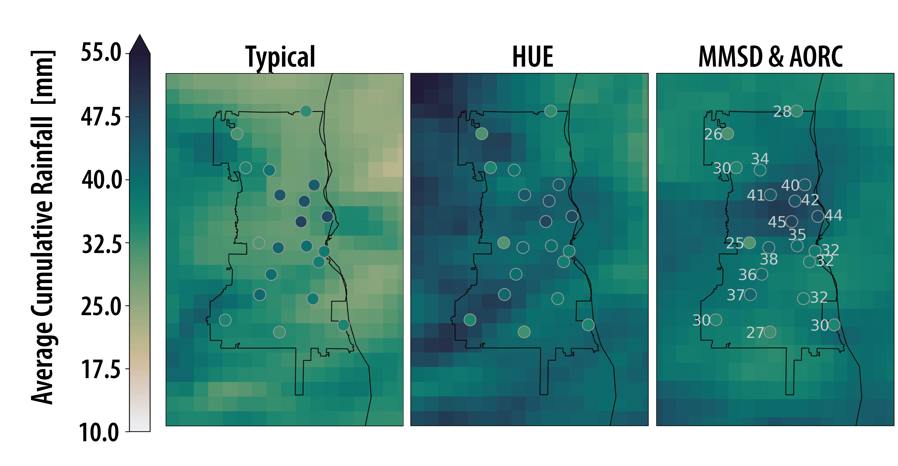
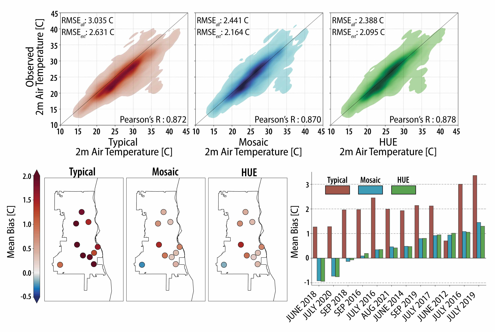

I am an atmospheric modeler, computational hydrologist, statistical hydrometeorologist, boundary layer meteorologist, and accidental engineer. My work is focused on better understanding the links between the atmosphere and the land surface where we live in areas of both extreme heterogeneity and human interactions. I have extensive experience developing a new land surface parametrization suitable to answer questions relating to human responses to climate change in urban spaces within high resolution climate models. I further work with big data in the form of satellites, in-situ, airplane, and imagery data with physically informed methods and statistical/machine learning approaches to quantify the changing extremes in regions around the globe. The overarching goal of my research is to create find intradisciplinary answers to inherently intradisciplinary questions that face society now and in the future. I work with  scientists in hydrology, atmospheric sciences, statistics, GIS, and remote sensing, while also working with policy makers and public facing groups to ensure my work is making the most impact.

# My current Projects:

# Ecohydrologic Processes Modify Urban Rainfall Intensification in Land-Atmosphere Simulations

Rainfall is one of the most important physical processes in urban regions, as it impacts day-to-day stormwater management and urban flood risk. Unfortunately, rainfall is one of the hardest physical processes to get correct in modern, convective permitting, regional simulations. In this study we compare Noah-MP HUE compared to other land-surface representations to see how urban land-atmosphere interactions feedback to hydrometeorological conditions leading to intense rainfall. 

> ### Key Results
> * Urban surface representation generates different near atmospheric conditions, such as cooler and more humid conditions in the afternoons when representing urban hydrology.
> * Urban rainfall is better represented in many storms, and creates a better spatial patter, though this does not fix all problems that styme convective regional models. 
> * HUE infiltrates more water compared to typical and mosaic simulations, which presents an exciting potential feedback to longer term urban climates. 

> ### Publication
> * [Ecohydrologic Processes Modify Urban Rainfall Intensification in Land-Atmosphere Simulations](https://essopenarchive.org/users/676081/articles/1377348-ecohydrologic-processes-modify-urban-rainfall-intensification-in-land-atmosphere-simulations) in Review 

 

# Previous Previous Projects:

Diagnosing the Impact of Fine-Scale Hydrologic Processes on Surface Energy Balance, Heat, and Humidity
=====

In regional to global climate models, urban representation is hit-or-miss: Some models represent urban spaces as flat impervious surfaces, others use a mosaicking scheme to represent multiple landcovers in a grid cell. These two approaches can lead to drastically different urban climate representations, but neglect features of urban hydrology. In this study we compare Noah-MP HUE to a simple mosaic scheme and a bulk scheme to evaluate their skill in simulating hydrometeorological extremes in Milwaukee, WI. 

> ### Key Results
> * Noah-MP for Heterogeneous Urban Environments (HUE) and mosaicking schemes increases albedo and emissivity in our urban region compared to a bulk scheme. 
> * Latent heat is enhanced in HUE when ample soil water is present, and diminished when there is low soil water conditions. Generally, this decreases in sensible heat fluxes. 
> * When compared to in-situ observations, HUE & Mosaic present much higher skill compared to the traditional urban representation, while HUE & Mosaic have comparable performance. 

> ### Publication
> * [City-Scale Evaluation of Urban Ecohydrologic Processes on Surface Energy Balance, Heat, and Humidity](https://doi.org/10.1016/j.uclim.2025.102596)

 

Sub-Grid Hydrologic Process Representation in Land Surface Models
=====

Urban spaces are complex patchworks of land-covers that interact with one another. Hydrologically, the routing of rainfall from impervious surfaces so pervious regions increases water storage and is a key component of urban climate adaptation. Tree cover, which shades pavements and intercepts rainfall are also critical. These features were note represented in land surface models, leaving large questions open on the impacts urban greening can have on the urban climate. I, and my team, developed a new parametrization suitable to model these interactions kilometer scale, making a first of its kind model suitable for coupled, land-atmosphere simulations. 

> ### Key Results
> * Noah-MP for Heterogeneous Urban Environments (HUE), with differing land-cover distributions was ran in Milwaukee, WI for different common greening implementations. 
> * Sensitivity analysis showed that greening practices can enhance infiltration while also enhancing the soil water consumption through larger Evapotranspiration. 

> ### Publication
> * [Urban Ecohydrology: Accounting for Sub-Grid Lateral Water and Energy Transfers in a Land Surface Model](https://doi.org/10.1029/2023WR035511)

 

<!-- 




  
 -->
