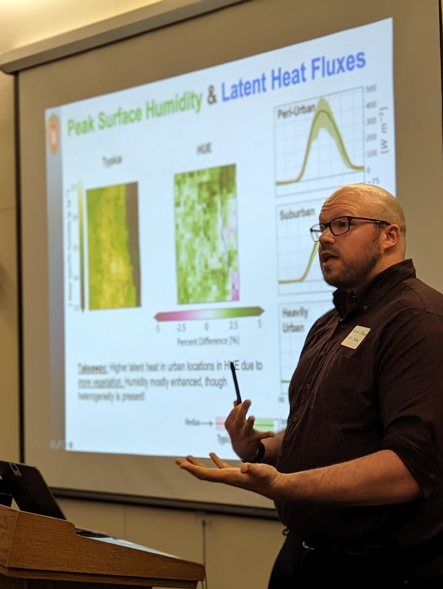
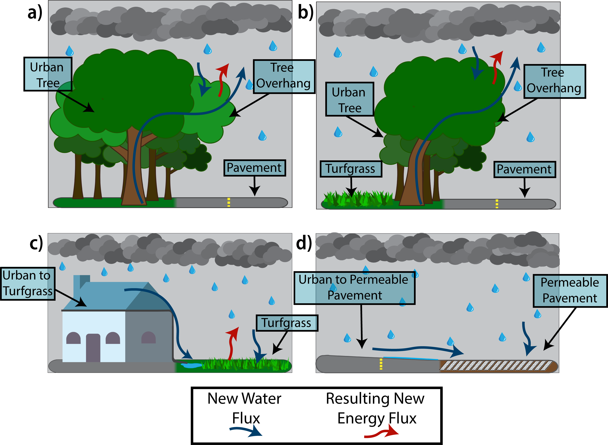

# My Current Research Has The Following Themes

I am an atmospheric modeler, computational hydrologist, statistical hydrometeorologist, boundary layer meteorologist, and accidental engineer. My work is focused on better understanding the links between the atmosphere and the land surface where we live in areas of both extreme heterogeneity and human interactions. I have extensive experience developing a new land surface parametrization suitable to answer questions relating to human responses to climate change in urban spaces within high resolution climate models. I further work with big data in the form of satellites, in-situ, airplane, and imagery data with physically informed methods and statistical/machine learning approaches to quantify the changing extremes in regions around the globe. The overarching goal of my research is to create find intradisciplinary answers to inherently intradisciplinary questions that face society now and in the future. I work with  scientists in hydrology, atmospheric sciences, statistics, GIS, and remote sensing, while also working with policy makers and public facing groups to ensure my work is making the most impact.

Sub-Grid Hydrologic Process Representation in Land Surface Models
=====

Urban spaces are complex patchworks of land-covers that interact with one another. Hydrologically, the routing of rainfall from impervious surfaces so pervious regions increases water storage and is a key component of urban climate adaptation. Tree cover, which shades pavements and intercepts rainfall are also critical. These features were note represented in land surface models, leaving large questions open on the impacts urban greening can have on the urban climate. I, and my team, developed a new parametrization suitable to model these interactions kilometer scale, making a first of its kind model suitable for coupled, land-atmosphere simulations. 

> ### Key Results
> * Noah-MP for Heterogeneous urban environments (HUE), with differing land-cover distributions was ran in Milwaukee, WI for different common greening implementations. 
> * Sensitivity analysis showed that greening practices can enhance infiltration while also enhancing the soil water consumption through larger Evapotranspiration. 

> ### Publication
> * [Urban Ecohydrology: Accounting for Sub-Grid Lateral Water and Energy Transfers in a Land Surface Model](https://doi.org/10.1029/2023WR035511)

 

## Current Projects

### integrating the Processes of Green Infrastructure in a Large-Scale Land Surface Model

<!-- 




  
 -->
