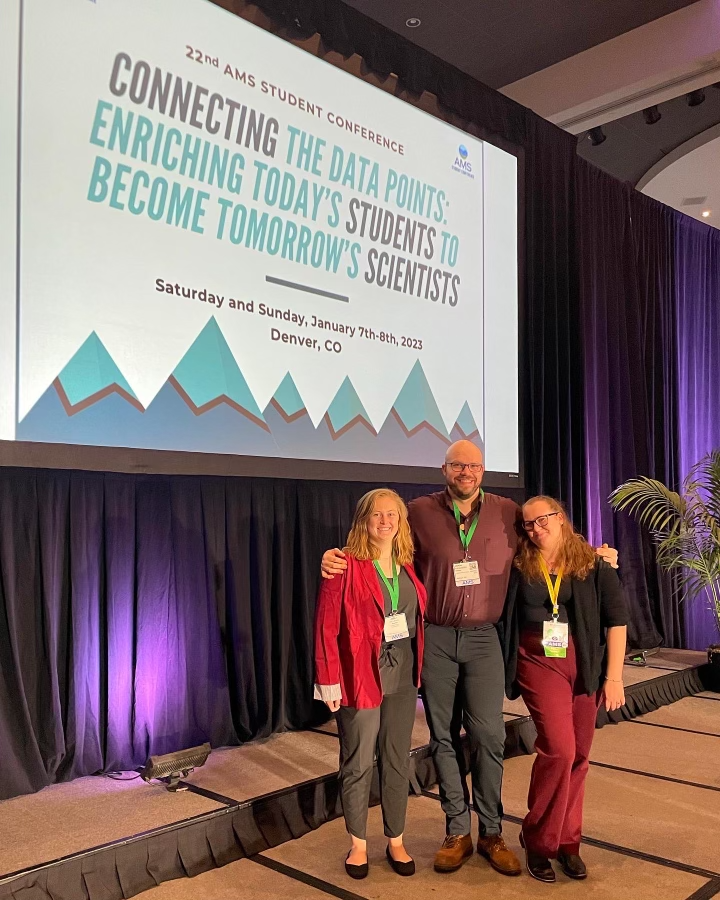

During my time as a graduate student, I have volunteered extensively with the American Meteorological Society (AMS). Much of the time with AMS focused on developing and chairing new student-centric sessions at the national AMS Student Conference. At AMS 2023 in Denver, CO, I was co-chair, leading the largest Student Conference at the time! Sessions I proposed and developed include “Skills for the Field”, which focuses on soft skills not taught in classrooms for professional development, and “Non-Traditional Careers”, where students were exposed to alternative ways to use their hard-won atmospheric sciences knowledge in career paths. This volunteerism led to helping develop BOSA, Board of Student Affairs, which is the first board in the history of AMS that is completely focused on students and ran by students!

In the classroom, I focus on teaching using evidence-based methods and real-world examples. I have taught a wide-range of courses, spanning from introductory fluid mechanics to hydroscience. My teaching technique focuses on 1) giving students as many real-world examples as possible to ensure the importance of what is being taught is never out of focus, 2) ensuring that there are many low stress checkpoints in the classroom to help test skills and give feedback (the first time a student gets feedback on something new should never be on a high-stress exam or quiz), and 3) engaging with students to create a classroom environment where students can ask questions, no matter how seemingly off the wall, without judgement. 
